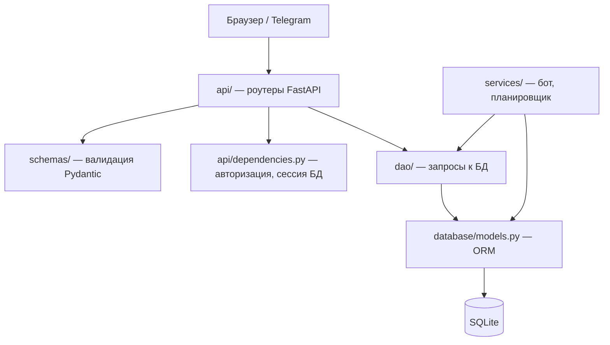
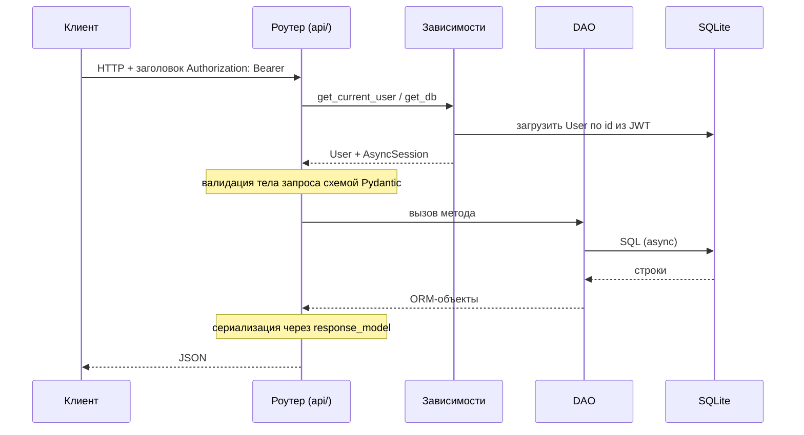

# Архитектура

## Обзор

Backend — на FastAPI с асинхронным SQLAlchemy поверх SQLite. Фронтенд —
одностраничное приложение на чистом JavaScript. Telegram-бот (aiogram) и
планировщик опросов работают фоновыми задачами **внутри того же процесса**,
что и веб-сервер.

## Технологии

- **Python 3.12**, **FastAPI**, **Uvicorn**
- **SQLAlchemy 2.0** (async) + **aiosqlite**, СУБД **SQLite**
- **aiogram 3.x** — Telegram-бот
- **PyJWT** + **bcrypt** — аутентификация
- **Pydantic** — валидация запросов и сериализация ответов
- Фронтенд — vanilla JS, без сборки и зависимостей

## Структура каталогов

```
task-treker-hsm/
├── main.py                 # точка входа: FastAPI app, CORS, статика, запуск фоновых задач
├── config.py               # конфигурация из переменных окружения (.env)
│
├── api/                    # HTTP-слой — роутеры FastAPI
│   ├── auth.py             #   POST /api/auth/login
│   ├── users.py            #   /api/users/*
│   ├── tasks.py            #   /api/tasks/*
│   ├── workgroups.py       #   /api/workgroups/*
│   └── dependencies.py     #   get_db, get_current_user, require_role
│
├── dao/                    # Data Access Object — запросы к БД
│   ├── user_dao.py
│   ├── task_dao.py
│   ├── workgroup_dao.py
│   └── project_dao.py
│
├── schemas/                # Pydantic-схемы (валидация запросов / форма ответов)
│   ├── user.py  task.py  workgroup.py  project.py
│
├── database/               # слой данных
│   ├── models.py           #   ORM-модели (таблицы)
│   ├── database.py         #   движок, сессии, init_db + миграции
│   └── tasks.db            #   файл SQLite (не в git)
│
├── services/               # бизнес-логика и фоновые сервисы
│   ├── task_poll_scheduler.py  # планировщик опросов о задачах
│   └── bot/                # Telegram-бот на aiogram — см. bot.md
│
├── utils/auth.py           # JWT + хэширование паролей (bcrypt)
├── static/                 # фронтенд — см. frontend.md
└── docs/                   # эта документация
```

Вспомогательные скрипты в корне: `create_project_manager.py` (создать
первого пользователя-проектника), `init_db.py`, `check_users.py`,
`list_users.py`, `test_system.py`, `test_login.py`.

## Слоистая архитектура



Правило: каждый слой обращается только к слою ниже. Роутеры не пишут SQL
напрямую — только через DAO. DAO ничего не знает про HTTP.

## Путь запроса

Пример: `POST /api/tasks/`



1. Uvicorn принимает запрос, FastAPI находит роутер в `api/`.
2. `Depends(get_current_user)` — извлекает JWT из `Authorization: Bearer`,
   декодирует, загружает `User`. Нет токена или невалиден → `401`.
3. `Depends(get_db)` — открывает `AsyncSession`.
4. Тело запроса валидируется Pydantic-схемой из `schemas/`.
5. Хендлер вызывает методы DAO.
6. Ответ сериализуется через `response_model`.
7. `get_db` делает `commit()` при успехе или `rollback()` при исключении.

## Аутентификация

- `POST /api/auth/login` — проверка логина и пароля (bcrypt, `utils/auth.py`).
  Успех → JWT, в котором `sub` = id пользователя, срок действия 24 часа.
- Фронтенд хранит токен в `localStorage` и передаёт его в заголовке
  `Authorization: Bearer <token>` при каждом запросе.
- `get_current_user` (`api/dependencies.py`) декодирует токен на каждом запросе
  и подгружает пользователя.
- `require_role(*roles)` — зависимость для ограничения доступа по ролям.
- Роль `WORKER` не имеет доступа к веб-интерфейсу — её логин отклоняется.

## Роли и иерархия

| Роль | Возможности |
|------|-------------|
| `PROJECT_MANAGER` (Проектник) | Полный доступ. Единственный, кто удаляет пользователей |
| `MAIN_ORGANIZER` (Главный организатор) | Создаёт рабочие группы, добавляет ответственных |
| `RESPONSIBLE` (Ответственный) | Управляет своими подчинёнными и задачами |
| `WORKER` (Работник) | Только Telegram-бот, без веб-интерфейса |

Иерархия подчинения хранится в `User.created_by_id` — самоссылка на
создателя пользователя. Перечень прав по каждому endpoint — в [api.md](api.md).

## Фоновые сервисы

При старте приложения (`startup_event` в `main.py`):

1. `init_db()` — создаёт таблицы и применяет миграции.
2. `poll_scheduler_loop()` — запускается фоновой задачей.
3. `start_bot()` — запускает Telegram-бота.

При остановке (`shutdown_event`) вызывается `stop_bot()`.

**Планировщик опросов** (`services/task_poll_scheduler.py`) — раз в 60 секунд
проверяет задачи. Для задач с настроенным опросом (`poll_interval_days` +
`poll_time`) отправляет напоминание исполнителям в Telegram, когда подошло
время.

**Telegram-бот** — см. [bot.md](bot.md).

> ⚠️ Бот и планировщик работают внутри процесса приложения. Запускать строго
> в **один процесс** (без `uvicorn --workers`), иначе несколько ботов будут
> конфликтовать за Telegram getUpdates.

## База данных

- SQLite, асинхронный доступ через `sqlite+aiosqlite`. Файл `database/tasks.db`.
- Схема создаётся автоматически из ORM-моделей при старте (`init_db`).
- Лёгкие миграции — через `ALTER TABLE` в `init_db()` (`database/database.py`):
  так добавлялись колонки опроса в уже существующие БД.
- Подробная схема, таблицы и связи — в [database.md](database.md).

## Как добавить новый функционал

Новый ресурс (например, «комментарии к задачам»):

1. **Модель** — добавить класс в `database/models.py`.
2. **Схемы** — новый файл в `schemas/` (Create / Update / Response).
3. **DAO** — новый файл в `dao/` с методами доступа к БД.
4. **Роутер** — новый файл в `api/`, подключить в `main.py` через
   `app.include_router(...)`.

Новая команда или функция бота — см. [bot.md](bot.md): достаточно добавить
роутер в `services/bot/handlers/`.
