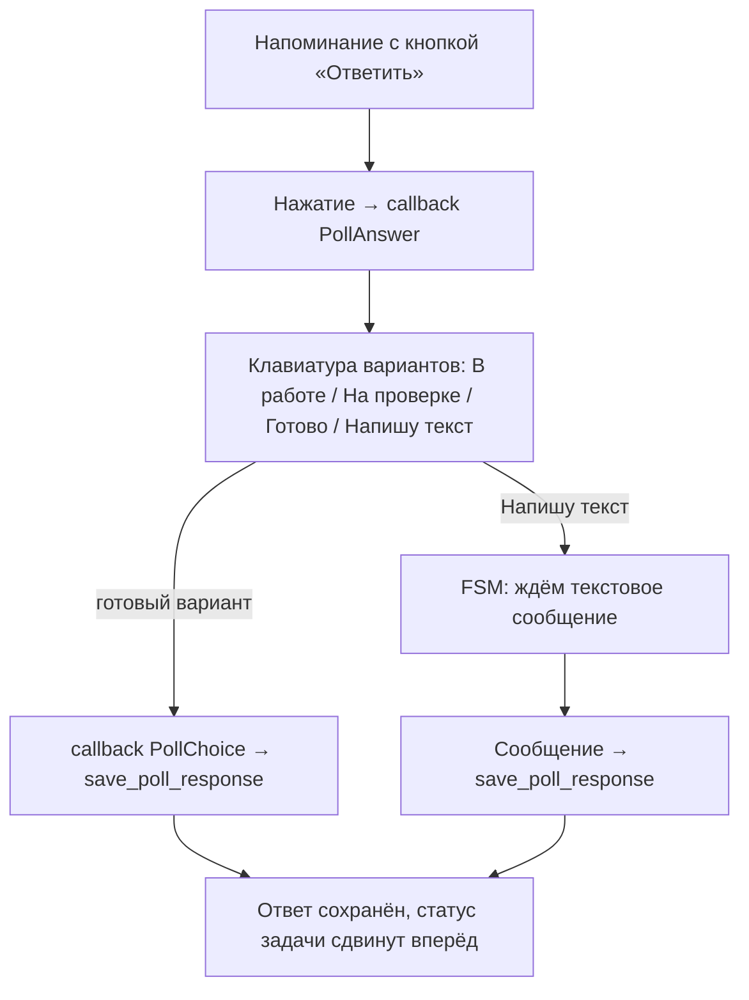

# Telegram-бот

Бот реализован на **aiogram 3.x** в пакете [services/bot/](../services/bot/).
Работает фоновой задачей внутри процесса приложения (long polling).

## Структура пакета

```
services/bot/
├── __init__.py        # публичный интерфейс: start_bot, stop_bot, notify_*
├── instance.py        # singletons Bot и Dispatcher
├── runner.py          # start_bot() / stop_bot() — жизненный цикл polling
├── notifications.py   # отправка уведомлений (вызывается из API и планировщика)
├── poll_service.py    # сохранение ответа на опрос в БД
├── keyboards.py       # inline-клавиатуры
├── callbacks.py       # CallbackData-фабрики для кнопок
├── states.py          # FSM-состояния
└── handlers/
    ├── __init__.py    # get_routers() — список роутеров
    ├── commands.py    # команды /start, /myid, /help
    └── poll.py        # обработка опросов (кнопки + текстовые ответы)
```

## Жизненный цикл

- `main.py` при старте вызывает `start_bot()`, при остановке — `stop_bot()`.
- `start_bot()` запускает `dp.start_polling()` фоновой задачей `asyncio`.
- Если `TELEGRAM_BOT_TOKEN` не задан — `get_bot()` возвращает `None`, и бот
  тихо не запускается (приложение при этом работает нормально).
- `stop_bot()` отменяет задачу polling и закрывает сессию бота.

Токен берётся из переменной окружения `TELEGRAM_BOT_TOKEN` (`config.py`).

## Команды

| Команда | Действие |
|---------|----------|
| `/start` | Приветствие. Показывает Telegram ID — его передают админу для добавления в систему |
| `/myid` | Показать Telegram ID пользователя |
| `/help` | Краткая справка |

## Опросы о задачах

Планировщик ([services/task_poll_scheduler.py](../services/task_poll_scheduler.py))
или ручной «тык» (`POST /api/tasks/{id}/nudge`) отправляет исполнителю
напоминание с кнопкой «📝 Ответить». Дальше:



- Кнопки описаны через `CallbackData`-фабрики (`callbacks.py`): `PollAnswer`,
  `PollChoice` — это типобезопасная упаковка данных кнопки (лимит Telegram —
  64 байта на `callback_data`).
- Вариант «Напишу текст» использует **FSM** (`states.py`,
  `PollResponseState.waiting_for_text`) — бот ждёт следующее текстовое
  сообщение пользователя. Хранилище состояний — `MemoryStorage` (в памяти,
  сбрасывается при рестарте).
- `save_poll_response` (`poll_service.py`) находит последний неотвеченный
  опрос по задаче, записывает текст и продвигает статус задачи на следующий
  этап.

## Уведомления

`notifications.py` экспортирует функции, которые вызываются из API-слоя и
планировщика:

| Функция | Когда вызывается |
|---------|------------------|
| `notify_role_assigned` | назначена/изменена роль пользователя |
| `notify_task_assigned` | пользователю назначена задача |
| `notify_task_poll` | напоминание-опрос о задаче |
| `send_message` | произвольное сообщение (например, тест из веб-интерфейса) |

Все функции безопасны при отсутствии токена — просто вернут `False`.

## Как добавить команду или функцию

1. Создайте модуль в `services/bot/handlers/` с собственным `Router`:

   ```python
   from aiogram import Router
   from aiogram.filters import Command
   from aiogram.types import Message

   router = Router(name="my_feature")

   @router.message(Command("mycmd"))
   async def my_handler(message: Message) -> None:
       await message.answer("Привет!")
   ```

2. Добавьте роутер в `get_routers()` в `services/bot/handlers/__init__.py`.

Порядок роутеров важен: апдейт обрабатывает первый подходящий хендлер.

Новые inline-кнопки — добавьте `CallbackData`-класс в `callbacks.py` и
клавиатуру в `keyboards.py`. Новое многошаговое взаимодействие — добавьте
состояние в `states.py`.
