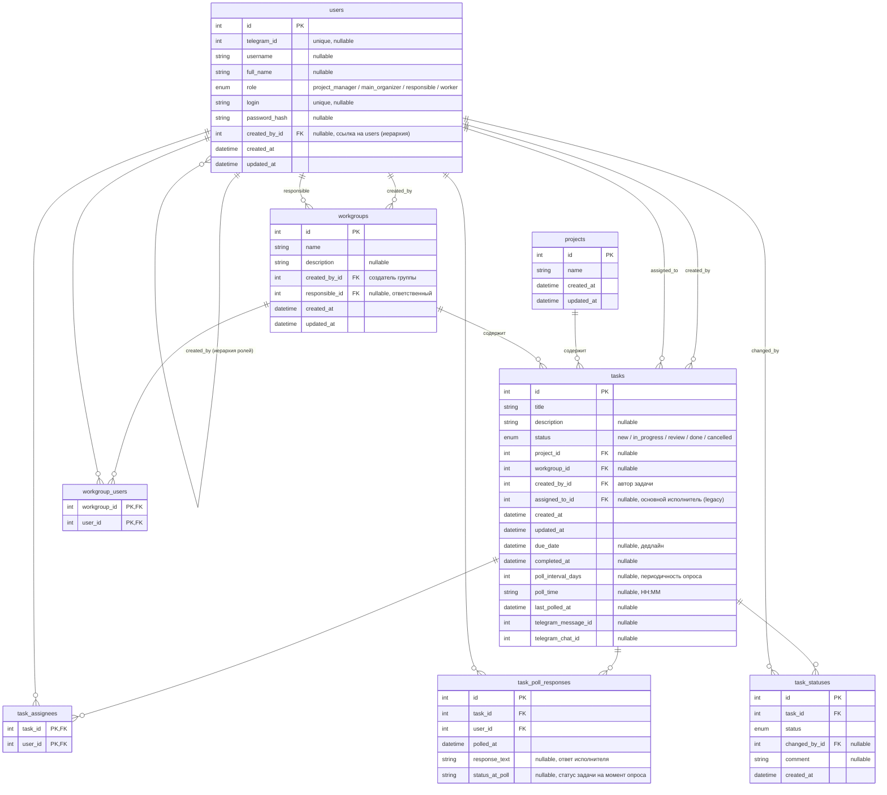

# Схема базы данных

Task Tracker (HSM) — SQLite, async SQLAlchemy 2.0. Таблицы создаются автоматически
из ORM-моделей ([database/models.py](../database/models.py)) при старте приложения.

## ER-диаграмма

## Таблицы

| Таблица | Назначение |
|---------|-----------|
| `users` | Пользователи. Иерархия подчинения — через самоссылку `created_by_id`. Роль `worker` не имеет доступа к вебу. |
| `projects` | Проекты. Контейнер верхнего уровня для задач. |
| `workgroups` | Рабочие группы. Создаются проектником / главным организатором, имеют ответственного. |
| `tasks` | Задачи. Статус, дедлайн, привязка к проекту/группе, настройки Telegram-опроса. |
| `task_poll_responses` | Ответы исполнителей на опросы-напоминания из Telegram-бота. |
| `task_statuses` | История изменений статусов задач. |
| `task_assignees` | Связующая M2M: задача ↔ исполнители. |
| `workgroup_users` | Связующая M2M: рабочая группа ↔ участники. |

## Связи

- **Иерархия пользователей** — `users.created_by_id → users.id` (самоссылка, `ON DELETE SET NULL`).
- **Исполнители задачи** — many-to-many через `task_assignees`. Поле `tasks.assigned_to_id` оставлено для обратной совместимости и хранит первого исполнителя.
- **Участники группы** — many-to-many через `workgroup_users`.
- **Задача** принадлежит опционально проекту и опциональной рабочей группе (`ON DELETE SET NULL`).

### Правила удаления (ON DELETE)

| Внешний ключ | Поведение |
|--------------|-----------|
| `users.created_by_id` | SET NULL |
| `workgroups.created_by_id` | CASCADE |
| `workgroups.responsible_id` | SET NULL |
| `tasks.project_id` / `tasks.workgroup_id` / `tasks.assigned_to_id` | SET NULL |
| `tasks.created_by_id` | CASCADE |
| `task_poll_responses.*`, `task_statuses.task_id`, обе M2M-таблицы | CASCADE |
| `task_statuses.changed_by_id` | SET NULL |

## Перечисления (enum)

- **`UserRoleEnum`**: `project_manager`, `main_organizer`, `responsible`, `worker`
- **`TaskStatusEnum`**: `new`, `in_progress`, `review`, `done`, `cancelled`

## Примечания

- Таблица **`task_statuses`** определена в моделях, но в текущем коде записи в неё
  **не создаются** — изменение статуса пишется напрямую в `tasks.status`. Таблица
  остаётся пустой (потенциальная точка для будущего аудита истории).
- Колонки опроса (`poll_interval_days`, `poll_time`, `last_polled_at`,
  `task_poll_responses.status_at_poll`) добавляются миграцией `ALTER TABLE` в
  [database/database.py](../database/database.py) для совместимости со старыми БД.
- Заметки вкладки «Шоб не забыть» в БД **не хранятся** — они живут только в
  `localStorage` браузера.
